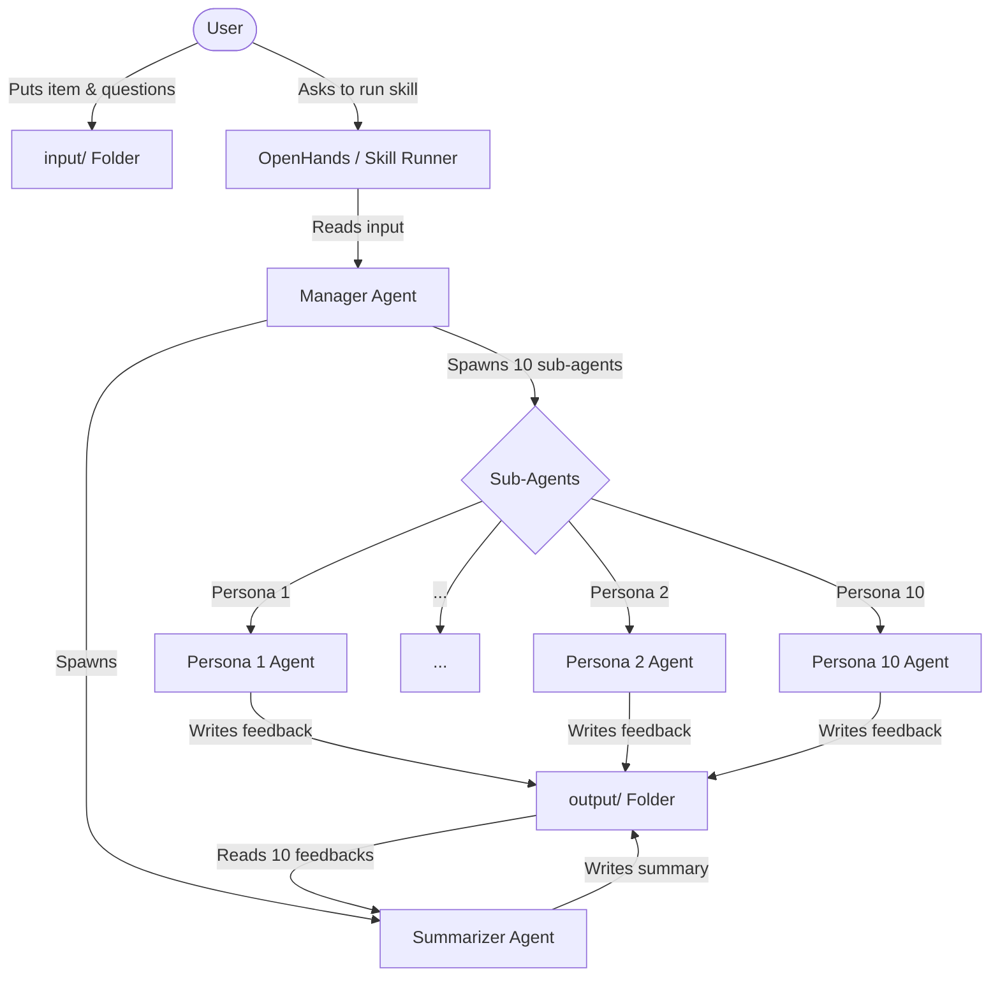

# Architecture: Synthetic Feedback Panel

## System Overview
The Synthetic Feedback Panel is designed to run as a "skill" or task within OpenHands (or a similar agentic framework). It orchestrates a multi-agent workflow to gather diverse feedback on a given input without context pollution.

## Component Diagram

## Key Components

### 1. File System Interface
- **`input/` Folder**: The entry point for the system. The user places the content to be reviewed here.
- **`output/` Folder**: The destination for all generated feedback. Files are named per persona to avoid collisions.
- **`.openhands/microagents/` Folder**: Contains the consolidated OpenHands skill definitions and persona profiles (microagents).
- **`.agents/skills/` Folder**: Contains other skills (e.g., utility skills like summarizer).

### 2. Orchestration (OpenHands Skill)
The core logic resides in a skill that:
- Reads the input files.
- Iterates over the skill files in `.openhands/microagents/`.
- For each persona, spawns an independent sub-agent.
- Passes the input content and the specific persona definition to the sub-agent.

### 3. Panelist Sub-Agents
- **Independence**: Each sub-agent is a fresh instance with no knowledge of other sub-agents or their outputs. This prevents context pollution and ensures authentic diverse feedback.
- **Persona Adoption**: The sub-agent is instructed to act as the character defined in the persona markdown file.

### 4. Summarizer Agent
- **Aggregation**: Once all sub-agents have completed their tasks, a final agent is spawned.
- **Synthesis**: This agent reads the 10 individual feedback files and produces a concise summary highlighting common themes, unique insights, and polarized opinions.

## Design Considerations
- **No Context Pollution**: Solved by using independent sub-agent spawns for each persona rather than a single conversation with multiple personas.
- **Extensibility**: New personas can be added simply by adding a new consolidated skill file to the `.openhands/microagents/` folder.
