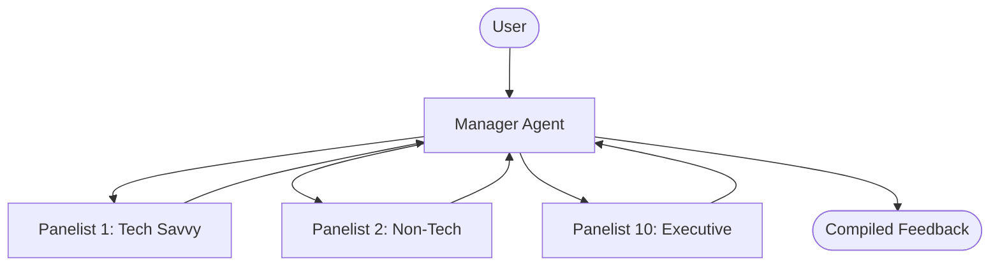

# System Design: Synthetic Feedback Panel

## Overview
The Synthetic Feedback Panel is a system designed to simulate 10 distinct synthetic users (personas) to provide feedback on presentations, demos, products, etc. The primary goal is to gather diverse perspectives without the need for real user testing in the early stages of development.

## Core Requirements
- **10 Synthetic Users**: Each with a distinct persona (background, goals, pain points, tech savviness).
- **Feedback Generation**: Ability to process input (text, slides, video transcripts) and generate constructive feedback.
- **No Context Pollution**: Each persona should operate independently to avoid bleeding of thoughts or bias from other personas.

## Architecture & Agentic Workflow
To achieve the requirement of avoiding context pollution, the system will leverage a multi-agent architecture.

### Target Platforms
- **OpenHands**
- **Hermes Agent**

### Agent Structure
We will use a "Manager" agent and "Panelist" agents.
- **Manager Agent**: Receives the artifact to be reviewed, distributes it to the panelists, collects feedback, and summarizes it.
- **Panelist Agents (10x)**: Each panelist is a sub-agent spawned with a specific system prompt defining its persona. They receive the artifact, process it, and return feedback to the manager.

## Personas
This panel is designed for testing **AI-native new product ideas** or presentations about them. The personas are based on real-world demographics to avoid functional prejudice (e.g., "The Skeptic") and ensure a diverse range of perspectives.

1. **The smart, tech-forward high school student**: Early adopter, values speed and convenience, may lack deep domain knowledge but understands tech trends.
2. **The elite college student**: High expectations, values innovation and prestige, future-oriented.
3. **The normal college student**: Pragmatic, cost-conscious, looking for tools that help with studies or social life.
4. **Young professional (Tech)**: Works at a company like Google. Deeply familiar with tech, expects high quality, values efficiency and automation.
5. **Young professional (Professional Services)**: Works at a big firm. Values reliability, clear value proposition, and professional utility.
6. **Young professional (Finance)**: Works at a big bank. Focuses on security, compliance, ROI, and efficiency.
7. **Mid-level Manager**: Manager or director at a big company. Focuses on team productivity, scalability, and business impact.
8. **Local Business Owner/Manager**: Medium-sized business. Focuses on operations, customer satisfaction, and manageable costs.
9. **Small Business Owner**: Community-focused. Values simplicity, affordability, and direct impact on their business.
10. **Independent Consultant**: Contracts for large companies. Values flexibility, personal productivity, and tools that make them look good to clients.

## Implementation Steps
1.  Define persona prompts in detail.
2.  Implement the Manager agent logic.
3.  Implement the Panelist agent logic (prompting).
4.  Integrate with OpenHands/Hermes (or simulate locally first using `uv`).
